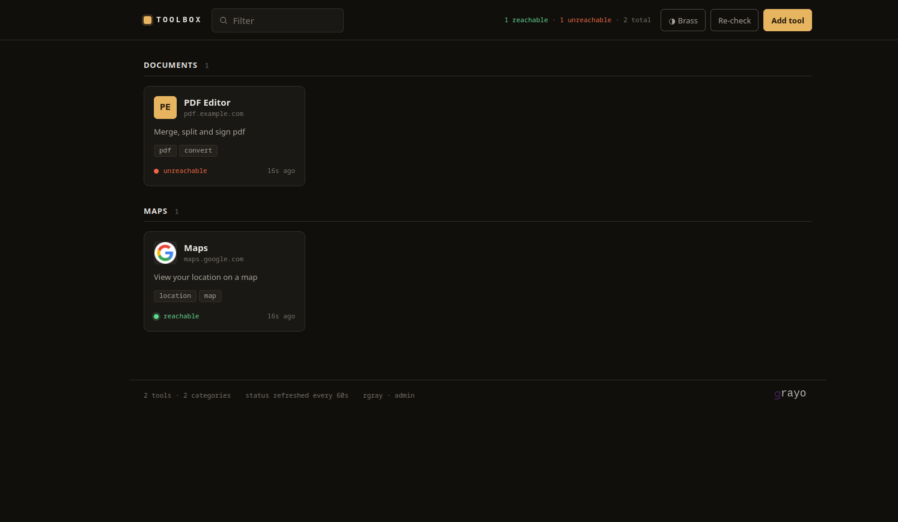
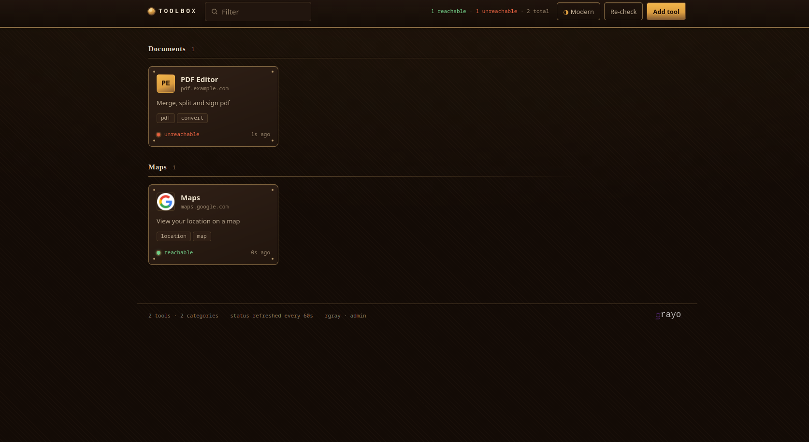
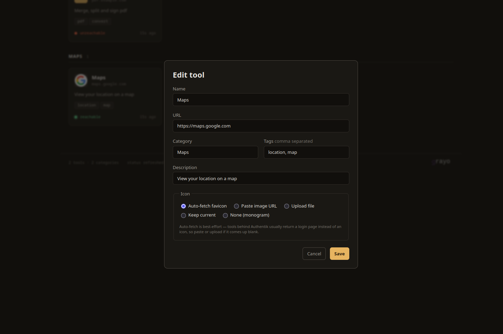
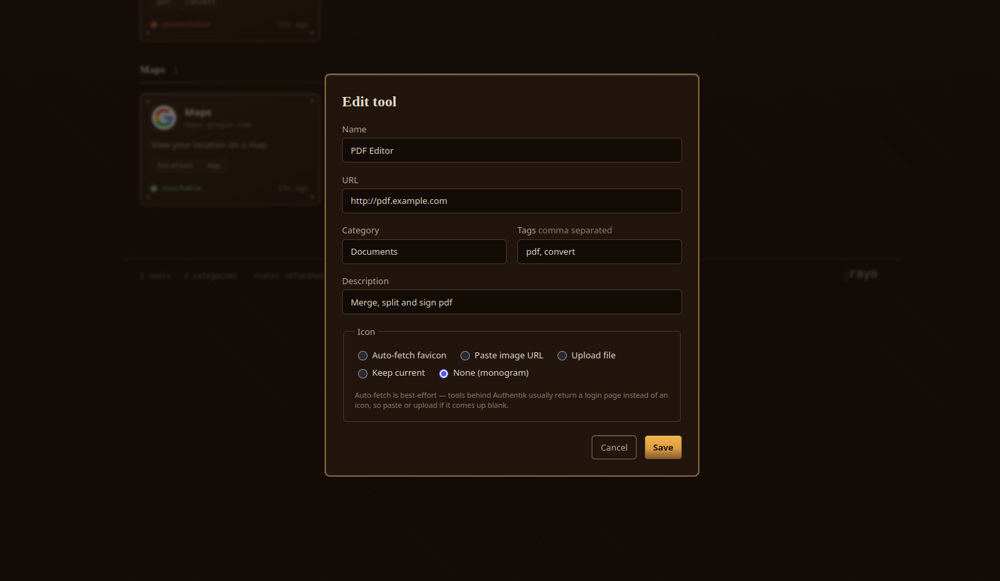

# Toolbox

A lightweight, self-hosted dashboard that links to all your Docker-based tools —
organised by category, with live health checks and browser-based editing. Designed
to sit behind an [Authentik](https://goauthentik.io) forward-auth proxy.



> **Admin view shown above.** The "Add tool" and "Re-check" buttons are only
> rendered for users who are members of the configured `ADMIN_GROUP`. Everyone
> else authenticated through the proxy sees the same dashboard but with no edit
> controls at all — the buttons are absent from the DOM, not just disabled.

## Features

- **Card grid grouped by category**, with live status dots and per-tool tags.
- **Role-aware UI** — edit controls ("Add tool", "Re-check", per-card edit/delete)
  are only rendered for Authentik users in the admin group; read-only users see a
  clean view with no edit affordances.
- **Edit from the browser** — admins can add, edit and delete entries without a
  redeploy.
- **Icons that survive the proxy** — best-effort favicon auto-fetch, with paste-URL
  and file-upload fallbacks. All icons are cached on the volume and served from
  Toolbox's own origin so the browser never hits the Authentik login page.
- **Health checks every 60 s** — a tool counts as *reachable* if it answers at
  all, including a 302 redirect to Authentik. Only connection/DNS failures and
  timeouts mark it unreachable.
- **Two built-in themes** — modern dark (graphite + amber) and brass (steampunk
  warm-gold), switchable in the UI and remembered per-browser.
- **Zero build step** — vanilla ES modules and CSS, no bundler, no external fonts.
  Works on air-gapped networks.

### Brass theme



### Edit dialog

| Modern | Brass |
|--------|-------|
|  |  |

## Quick start

### Using Docker Compose (recommended)

Create a `docker-compose.yml` in a new directory:

```yaml
services:
  toolbox:
    image: rorgray/toolbox:latest
    container_name: toolbox
    restart: unless-stopped
    environment:
      # Group whose members may add/edit/delete entries.
      # Leave empty to let any authenticated user edit.
      ADMIN_GROUP: "toolbox-admins"
      # Reject requests that arrive without the Authentik user header
      # (i.e. direct hits that bypass the proxy).
      REQUIRE_AUTH_HEADER: "true"
    volumes:
      - toolbox-data:/data
    expose:
      - "3000"
    networks:
      - proxy

    # --- Traefik labels (uncomment + adapt) ---
    # labels:
    #   - "traefik.enable=true"
    #   - "traefik.http.routers.toolbox.rule=Host(`tools.example.com`)"
    #   - "traefik.http.routers.toolbox.entrypoints=websecure"
    #   - "traefik.http.routers.toolbox.tls.certresolver=le"
    #   # attach the Authentik forward-auth middleware you defined elsewhere:
    #   - "traefik.http.routers.toolbox.middlewares=authentik@docker"
    #   - "traefik.http.services.toolbox.loadbalancer.server.port=3000"

volumes:
  toolbox-data:

networks:
  proxy:
    external: true
```

Then:

```bash
docker compose up -d
```

The app listens on port `3000` inside the container and persists everything to
the `toolbox-data` volume (`/data/tools.json` plus `/data/icons`). It does **not**
publish a host port — route traffic to it through your reverse proxy / Authentik
outpost.

The image is published at **[rorgray/toolbox](https://hub.docker.com/r/rorgray/toolbox)**.
Tags follow semver (`v1.2.3`, `1.2`, `1`) plus `latest` on every push to `master`.

### Local development (no auth)

```bash
git clone https://github.com/RorGray/toolbox.git
cd toolbox
npm install
cp .env.example .env   # tweak DEV_USER / paths if you like
npm run dev            # auto-restarts on change, listens on :3000
# open http://localhost:3000
```

`npm run dev` reads `.env` via Node's built-in `--env-file`. The shipped
`.env.example` sets `REQUIRE_AUTH_HEADER=false` and a `DEV_USER`, so you can
add and edit entries without an Authentik proxy. Or as a one-liner:

```bash
REQUIRE_AUTH_HEADER=false ADMIN_GROUP="" DEV_USER=dev DATA_FILE=./data/tools.json ICON_DIR=./icons npm start
```

## Putting it behind Authentik

Toolbox uses Authentik's **proxy provider (forward auth)** — not OIDC. There is
no login flow, client secret, or callback URL to configure in the app. Authentik
authenticates requests at the edge and injects identity headers; Toolbox reads and
trusts them.

1. In Authentik, create a **Proxy Provider** in *forward auth (single application)*
   mode for your domain (e.g. `tools.example.com`).
2. Add the provider to your **outpost** and configure your reverse proxy to pass
   requests through the outpost's `/outpost.goauthentik.io/auth/...` endpoint.
   The Traefik labels in the example compose file above show the shape of this;
   nginx and Caddy work equally well.
3. Create a group named `toolbox-admins` (or whatever you set `ADMIN_GROUP` to)
   and add the users who should be able to edit entries.

Authentik forwards these headers, which Toolbox reads:

| Header                  | Used for                            |
| ----------------------- | ----------------------------------- |
| `X-authentik-username`  | Identifying the signed-in user      |
| `X-authentik-groups`    | Deciding who may edit (admin gate)  |

> **Tip:** Make sure the groups claim is actually forwarded. In the Proxy
> Provider's settings, `X-authentik-groups` is included by default — if you've
> customised the header mapping, keep groups in the forwarded set or editing
> will be denied for everyone.

### Defense in depth

`REQUIRE_AUTH_HEADER=true` (the default) makes Toolbox reject any request that
arrives without the username header — i.e. a direct hit to the container on the
Docker network that bypassed the proxy. Keep it enabled unless you secure the
app some other way.

## Configuration

All knobs are environment variables:

| Variable              | Default                  | Meaning                                                                    |
| --------------------- | ------------------------ | -------------------------------------------------------------------------- |
| `PORT`                | `3000`                   | Listen port.                                                               |
| `DATA_FILE`           | `/data/tools.json`       | Entry store (human-readable JSON, safe to hand-edit while running).        |
| `ICON_DIR`            | `/data/icons`            | Cached icon files.                                                         |
| `ADMIN_GROUP`         | `toolbox-admins`         | Authentik group allowed to edit. Empty = any authenticated user can edit.  |
| `REQUIRE_AUTH_HEADER` | `true`                   | Reject requests missing the Authentik user header.                         |
| `DEV_USER`            | _(empty)_                | Local-dev fallback identity. Only active when `REQUIRE_AUTH_HEADER=false`. |
| `DEV_GROUPS`          | _(empty)_                | Groups for `DEV_USER` (only relevant with a non-empty `ADMIN_GROUP`).      |
| `AUTH_HEADER_USER`    | `x-authentik-username`   | Override if you renamed the header in your Authentik provider.             |
| `AUTH_HEADER_GROUPS`  | `x-authentik-groups`     | Override if you renamed the header in your Authentik provider.             |
| `HEALTH_INTERVAL_MS`  | `60000`                  | Background ping interval in milliseconds.                                  |
| `HEALTH_TIMEOUT_MS`   | `5000`                   | Per-check timeout in milliseconds.                                         |
| `MAX_ICON_BYTES`      | `524288`                 | Maximum cached icon size in bytes.                                         |

## Editing entries by hand

`tools.json` is plain JSON and safe to edit while the app runs — the web UI
writes atomically and serialises concurrent writes so the two won't corrupt each
other. An entry looks like:

```json
{
  "id": "a1b2c3d4e5f6a7b8",
  "name": "PDF Editor",
  "url": "https://pdf.tools.example.com",
  "description": "Merge, split and sign PDFs.",
  "category": "Documents",
  "tags": ["pdf", "sign"],
  "iconFile": "a1b2c3d4e5f6a7b8.png",
  "health": { "status": "up", "httpStatus": 302, "checkedAt": "..." }
}
```

## Icons

Because your tools also sit behind Authentik, a server-side favicon fetch will
usually receive the **login page** rather than an icon. Toolbox detects this
(it checks for an actual image, rejecting HTML) and silently falls back. Expect
to paste an image URL or upload a file for most tools — auto-fetch works for
anything reachable without auth. Until an icon is set the card shows a coloured
monogram.

## Architecture

```
toolbox/
├── server.js            Express app + routes
├── lib/
│   ├── config.js        env-driven config
│   ├── auth.js          Authentik header parsing + admin gate
│   ├── store.js         JSON store, atomic writes, write lock
│   ├── icons.js         favicon fetch / upload / caching + sniffing
│   └── health.js        background pinger
├── public/              UI (index.html, app.js, styles.css)
├── data/tools.json      seed entries (replace with your own)
├── Dockerfile
└── docker-compose.yml
```

- **Backend:** Node 20 + Express, ~5 small modules, one runtime dependency.
- **Store:** a single JSON file on a mounted volume; atomic writes behind an
  in-process lock.
- **Image:** `node:20-alpine`, runs as the non-root `node` user, with a
  container `HEALTHCHECK` on the unauthenticated `/healthz` endpoint.

## License

[Elastic License 2.0 (ELv2)](LICENSE) — free to use and self-host, including
within a company for internal purposes. You may not offer Toolbox as a hosted
or managed service to third parties without explicit written permission.
